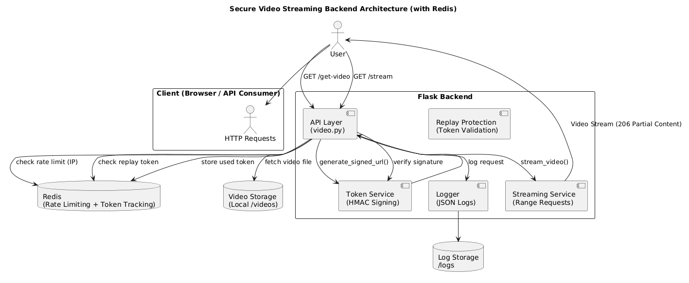
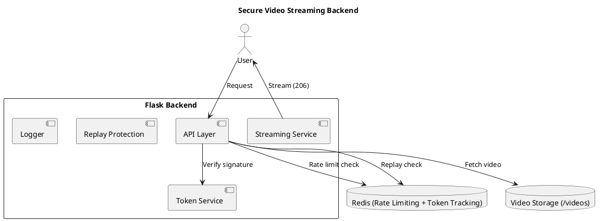
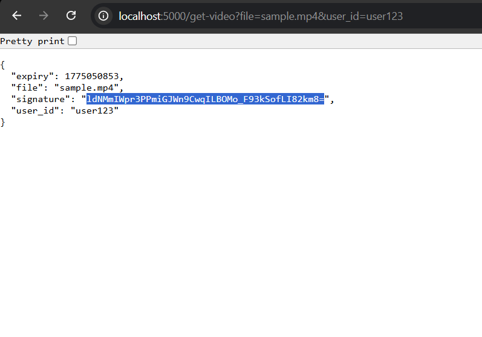
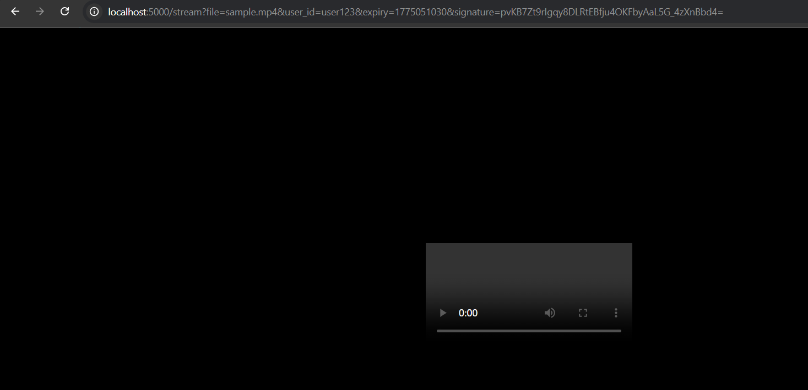
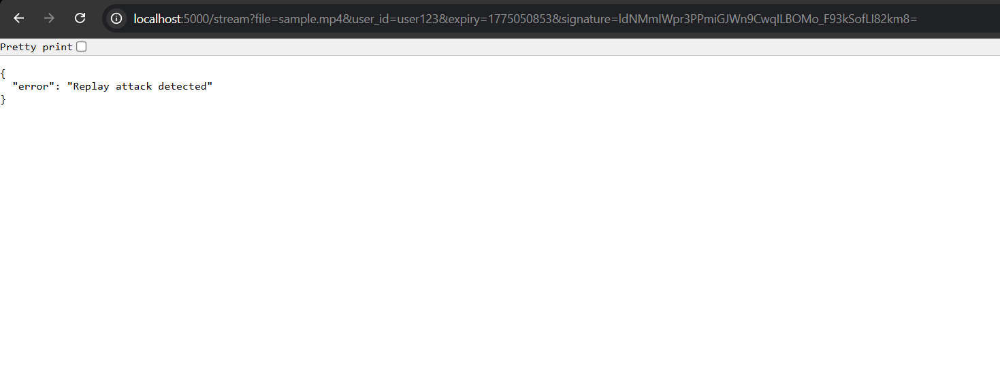

# 🔐 Secure Video Streaming Backend

A production-style backend system for secure video delivery, designed to simulate how real-world platforms protect and stream media content at scale.

This project focuses on **API security, streaming systems, and backend architecture**, implementing multiple layers of protection against unauthorized access, replay attacks, and abuse.

---

## 🚀 Overview

This backend enables controlled video streaming using **signed URLs, access control, and request validation mechanisms**.

It demonstrates how modern backend systems:

* Secure media access using cryptographic tokens
* Prevent replay attacks and link sharing
* Handle streaming efficiently using HTTP range requests
* Monitor and protect APIs from abuse

---

## 🧠 Core Features

### 🔑 Tokenized Access (HMAC Signing)

* Generates secure, time-bound URLs
* Uses HMAC-SHA256 for tamper-proof signatures
* Prevents unauthorized link modification

---

### 👤 Access Control

* Enforces user-level authorization
* Ensures only valid users can access specific content
* Simulates real-world ownership checks

---

### 🔁 Replay Attack Protection

* Detects and blocks reused tokens
* Ensures each signed URL is single-use
* Prevents link sharing and repeated access

---

### 🚦 Rate Limiting

* Limits requests per IP within a time window
* Prevents scraping and automated abuse
* Designed to scale with Redis in production

---

### 📺 Streaming System (HTTP Range Requests)

* Implements partial content delivery (206)
* Enables efficient video playback
* Mimics real streaming platforms

---

### 📊 Structured Logging & Monitoring

* Logs requests in structured JSON format
* Tracks API usage and failed attempts
* Enables detection of suspicious activity

---

## 🏗️ Architecture





---

## 🧪 Execution Flow

### Step 1: Generate Secure URL

* Client requests `/get-video`
* Server generates signed token using file, user_id, and expiry

### Step 2: Request Streaming

* Client sends `/stream` request with token
* Backend validates:

  * Signature integrity
  * Expiry time
  * User authorization

### Step 3: Security Checks

* Rate limiting applied
* Replay attack detection
* Unauthorized access blocked

### Step 4: Video Streaming

* Video served using HTTP range requests
* Efficient chunk-based delivery

---

## 📸 Demonstration





---

## ⚙️ Setup & Installation

### 1. Clone Repository

```bash
git clone <your-repo-link>
cd secure-video-streaming-backend
```

### 2. Install Dependencies

```bash
pip install -r requirements.txt
```

### 3. Add Sample Video

Place a file inside:

```
/videos/sample.mp4
```

### 4. Run Server

```bash
python run.py
```

Server runs at:

```
http://localhost:5000
```

---

## 🔗 API Endpoints

### Generate Token

```
GET /get-video?file=sample.mp4&user_id=user123
```

### Stream Video

```
GET /stream?file=sample.mp4&user_id=user123&expiry=XXX&signature=XXX
```

---

## 🔐 Security Design

| Layer             | Purpose           |
| ----------------- | ----------------- |
| Signed URLs       | Prevent tampering |
| Expiry            | Limit access time |
| Replay protection | Block reuse       |
| Rate limiting     | Prevent abuse     |
| Access control    | Enforce ownership |

---

## 🧠 Design Considerations

* Modular architecture for scalability
* Separation of concerns (services, routes, utils)
* Security-first API design
* Easily extendable to distributed systems

---

## 🚀 Future Enhancements

* Integrate Redis for distributed rate limiting
* Use AWS S3 for video storage
* Add CDN (CloudFront) for global delivery
* Implement HLS/DASH adaptive streaming
* Add JWT authentication layer
* Introduce monitoring (Prometheus, Grafana)
* Convert to microservices architecture

---

## 🎯 Key Takeaways

This project demonstrates:

* Backend system design
* API security implementation
* Streaming infrastructure basics
* Real-world system thinking

---

## 📌 Resume Description

Built a secure video streaming backend using Flask with HMAC-based signed URLs, replay attack prevention, rate limiting, and structured logging for monitoring and abuse detection.

---

## 👨‍💻 Author

Abhishek
Backend & Systems Developer
